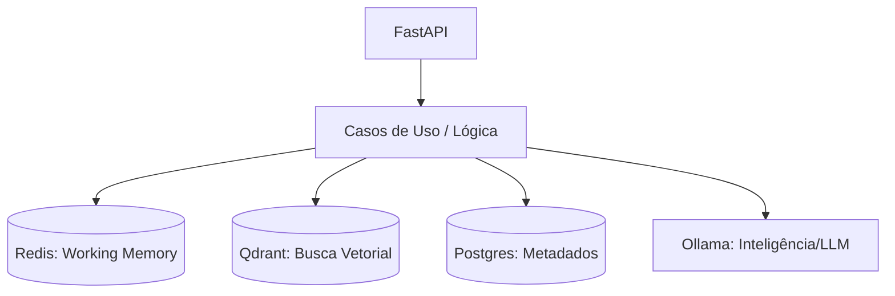

# Agent Memory Engine 🧠


> Uma engine de memória avançada para agentes de IA que precisam lembrar do passado, aprender com o presente e planejar o futuro.

Este projeto não é apenas um banco de dados; é um **sistema nervoso central** para agentes de Inteligência Artificial. Ele decide o que é importante lembrar, o que deve ser esquecido e como recuperar a informação certa no momento certo.

---

## 🧭 Visão Geral (O que é isso?)

Imagine que você está construindo um assistente pessoal.
- Se ele esquecer o que você disse há 5 segundos, ele é **burro**.
- Se ele ler 500 páginas de logs toda vez que você fizer uma pergunta, ele é **lento**.
- Se ele trouxer a mesma resposta repetida 10 vezes, ele é **chato**.

O **Agent Memory Engine** resolve isso separando a memória em camadas (como o cérebro humano) e usando algoritmos matemáticos sênior para buscar dados.

### 🧠 Como a memória é organizada:
1.  **Working Memory (RAM)**: Fica no **Redis**. Guarda os últimos segundos da conversa. É instantâneo.
2.  **Semantic Memory (Fatos)**: Fica no **Qdrant**. Guarda o significado das coisas (ex: "O usuário gosta de café").
3.  **Episodic Memory (Diário)**: Fica no **PostgreSQL**. Guarda a sequência dos fatos (o que veio antes do quê).
4.  **Hierarchical Memory (Resumos)**: Organiza tudo em níveis. Do detalhe bruto ao resumo global do usuário.

---

## 🏗️ Arquitetura e Tecnologias



- **FastAPI**: A porta de entrada rápida e moderna.
- **Qdrant**: Onde a mágica da busca por significado acontece.
- **Redis**: Onde guardamos o contexto "quente" da conversa.
- **Postgres**: Nossa fonte da verdade para dados estruturados.
- **Ollama**: O cérebro local que gera textos e entende frases.

---

## 🚀 Funcionalidades Incríveis (Nível Sênior)

### 🔎 Mecanismos de Busca Potentes
- **Busca Híbrida**: O sistema busca por **significado** e por **palavras exatas** ao mesmo tempo.
- **Diversidade (MMR)**: Se houverem respostas muito parecidas, o sistema escolhe as mais diferentes para enriquecer o contexto.
- **Ponderação por Tempo**: Coisas novas valem mais que coisas velhas.
- **Personalização**: A busca se adapta ao perfil do usuário (ex: se você é dev, ele prioriza termos técnicos).

### ⚙️ Processamento em Background
- **Reflexão Automática**: A cada 4 horas, o agente "dorme e sonha" (reflete), gerando novos insights sobre o usuário.
- **Decaimento (Esquecimento)**: Memórias inúteis perdem força sozinhas com o tempo, limpando o ruído.

---

## 🧪 Como Testar e Rodar (Docker)

Nós usamos **Docker** para que você não precise instalar nada pesado na sua máquina.

### 1. Preparar o Ambiente
```bash
cp .env.example .env
docker-compose build app
```

### 2. Rodar a Suíte de Testes (Validando a Qualidade)
Este comando roda todos os testes (Unitários e Integração) e mostra a cobertura de código (**84%**):
```bash
docker-compose run -e PYTHONPATH=/app app pytest --cov=app --cov-report=term-missing tests
```

### 3. Subir o Sistema
```bash
make docker-up
```

---

## 📖 Documentação Detalhada

Para entender a teoria por trás de cada um dos 20 conceitos implementados (ex: RRF, MMR, Decay), acesse:
👉 **[ANALISE_MEMORIA.md](./ANALISE_MEMORIA.md)**

---

## 🛠️ Decisões de Projeto
- **Local-First**: Tudo roda na sua máquina (via Ollama), garantindo privacidade total.
- **Clean Architecture**: A lógica de negócio é separada dos bancos de dados, facilitando a troca de tecnologias no futuro.
- **Totalmente Assíncrono**: O sistema nunca "trava" esperando um banco de dados lento.
