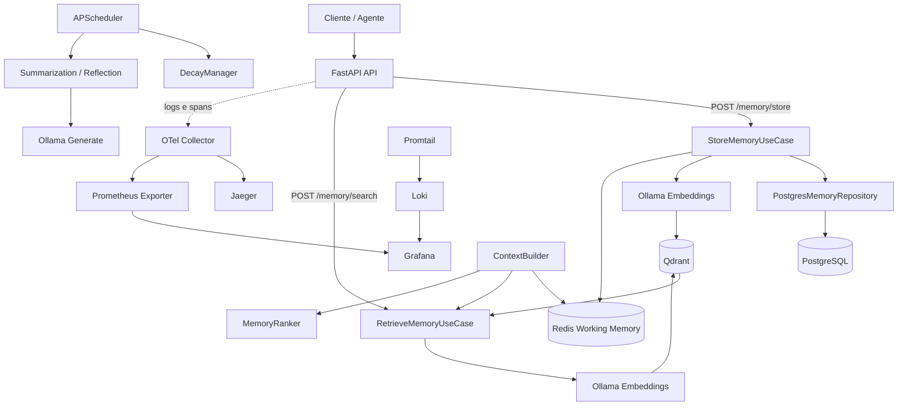

# Agent Memory Engine


> Engine local-first para memoria de agentes de IA, com separacao entre working memory, memoria semantica, metadados transacionais e observabilidade.

Este projeto implementa a base de um sistema de memoria para agentes que precisam lembrar fatos relevantes, recuperar contexto semanticamente e manter um historico operacional observavel. A API exposta em FastAPI permite gravar memorias com metadados, persisti-las em PostgreSQL, vetorizalas em Qdrant quando necessario e manter uma janela curta de contexto em Redis.

O repositorio tambem inclui componentes de orquestracao para construir contexto final do agente, aplicar time decay, gerar resumos e preparar rotinas periodicas de reflexao. Parte dessas pecas ja esta integrada na camada de aplicacao e coberta por testes; outras estao como scaffold pronto para evolucao.

## 📚 Sumário

- [🧭 Visão Geral](#visao-geral)
- [🏗️ Arquitetura](#arquitetura)
- [🔄 Fluxos do Projeto](#fluxos-do-projeto)
- [🧰 Tecnologias e Serviços](#tecnologias-e-servicos)
- [📁 Estrutura do Repositório](#estrutura-do-repositorio)
- [🚀 Instalação](#instalacao)
- [🧪 Como Usar](#como-usar)
- [🔎 Como Verificar Cada Serviço](#como-verificar-cada-servico)
- [📊 Observabilidade](#observabilidade)
- [✅ Testes e Coverage](#testes-e-coverage)
- [📖 Conceitos de Memória](#conceitos-de-memoria)
- [🛠️ Troubleshooting](#troubleshooting)

<a id="visao-geral"></a>

## 🧭 Visão Geral

O `llm-agent-memory` foi pensado como uma base modular para agentes com memoria de curta e longa duracao. Em vez de jogar todo o contexto em um unico banco, o projeto separa responsabilidades:

1. **Working Memory**: mensagens recentes e contexto quente ficam em Redis, com lista deslizante limitada por tamanho.
2. **Semantic Memory**: fatos de longo prazo sao embedados com Ollama e indexados no Qdrant para busca vetorial por similaridade.
3. **Metadata Store**: o registro transacional da memoria fica em PostgreSQL, com `session_id`, `agent_id`, `importance_score`, timestamps e metadados livres.
4. **Application Services**: casos de uso, ranking, resumo e montagem de contexto vivem na camada de aplicacao, sem acoplamento direto com HTTP.
5. **Observability Stack**: logs estruturados, spans manuais e stack local com OTel Collector, Jaeger, Prometheus, Grafana, Loki e Promtail.

### O que ja esta implementado hoje

- endpoint para gravar memorias em `POST /memory/store`;
- endpoint para busca semantica em `POST /memory/search`;
- persistencia assincrona em PostgreSQL;
- working memory em Redis com sliding window;
- armazenamento vetorial em Qdrant para memorias semanticas;
- cliente Ollama com retries exponenciais;
- `ContextBuilder`, `MemoryRanker`, `DecayManager`, `SummarizationService` e scheduler como blocos reutilizaveis;
- testes unitarios e de integracao para dominio e adaptadores principais.

### O que esta como scaffold pronto para evolucao

- exposicao HTTP direta para `ContextBuilder` e resumacao;
- rotina real do scheduler para decay/reflection em lote;
- pipeline de bootstrapping completo da telemetria OTLP na aplicacao;
- versionamento inicial de migrations Alembic no repositorio.

<a id="arquitetura"></a>

## 🏗️ Arquitetura



### Leitura da arquitetura

- **FastAPI** recebe chamadas externas e injeta sessao de banco quando necessario.
- **Camada de aplicacao** controla o fluxo de negocio: criar entidade, vetorizacao, persistencia e cache.
- **PostgreSQL** guarda a representacao canônica da memoria.
- **Qdrant** existe para recuperar conhecimento semanticamente parecido com a pergunta atual.
- **Redis** serve como working memory de baixissima latencia.
- **Ollama** e usado para embeddings e tambem para sumarizacao/reflexao.
- **OTel + Jaeger + Grafana + Loki** formam a base de observabilidade local.

<a id="fluxos-do-projeto"></a>

## 🔄 Fluxos do Projeto

### 🧠 Fluxo 1: Armazenar Memória

1. O cliente chama `POST /memory/store` com `content`, `memory_type`, `session_id` e metadados opcionais.
2. A API cria um `StoreMemoryUseCase` com os adapters concretos.
3. O caso de uso instancia uma entidade `BaseMemory` com UUID, timestamps e score inicial.
4. Se o tipo for `semantic`, o texto e enviado ao Ollama para gerar embedding.
5. O vetor gerado e gravado no Qdrant com payload contendo `session_id` e `content`.
6. A memoria e persistida no PostgreSQL com tipo, score, sessao, agente e `extra`.
7. Se o tipo for `working`, o texto tambem entra na lista Redis `working_mem:{session_id}`.
8. A resposta retorna um objeto normalizado com `id`, `content`, `memory_type`, `session_id`, `importance_score` e `created_at`.

### 🔎 Fluxo 2: Recuperar Memória Semântica

1. O cliente chama `POST /memory/search` com `query`, `session_id` e `limit`.
2. A API cria um `RetrieveMemoryUseCase`.
3. O texto da busca e embedado pelo Ollama com o modelo configurado para embeddings.
4. O Qdrant recebe a query vetorial e um filtro opcional por `session_id`.
5. Os hits retornam com `id`, `payload` e `score`.
6. O caso de uso simplifica o retorno para uma lista com `content`, `score` e `id`.

### 🧱 Fluxo 3: Montagem de Contexto para o Agente

1. O `ContextBuilder` consulta a working memory no Redis.
2. Em seguida recupera memorias semanticas relevantes via `RetrieveMemoryUseCase`.
3. O resultado e organizado em blocos textuais como `RECENT CONVERSATION` e `RELEVANT KNOWLEDGE`.
4. O `MemoryRanker` ja existe para evoluir a ordenacao combinando similaridade, recencia e importancia.

### ⏱️ Fluxo 4: Decay, Resumo e Reflexão

1. O `DecayManager` aplica decaimento exponencial no `importance_score` com base no tempo desde a criacao.
2. O `SummarizationService` usa um modelo LLM no Ollama para comprimir lotes de memorias.
3. O scheduler (`app/workers/scheduler.py`) agenda duas tarefas periodicas:
   - decay a cada 1 hora;
   - geracao de reflexoes a cada 4 horas.
4. No estado atual do projeto, essas tarefas estao definidas como estrutura operacional, mas ainda sem pipeline final conectado ao banco.

<a id="tecnologias-e-servicos"></a>

## 🧰 Tecnologias e Serviços

| Serviço | Tecnologia | Porta | Papel no projeto | O que verificar |
|---|---:|---:|---|---|
| 🌐 API | FastAPI | `8000` | Expor endpoints de armazenamento, busca e health checks. | `/docs`, `/health/live`, `/health/ready`. |
| 🧠 Embeddings / LLM | Ollama | `11434` | Gerar embeddings e respostas de sumarizacao/reflexao localmente. | `GET /api/tags` e existencia dos modelos `llama3` e `nomic-embed-text`. |
| 🗃️ Vetores | Qdrant | `6333` | Armazenar e buscar memorias semanticas por similaridade. | Colecao `agent_memories` criada no startup da API. |
| 🧾 Metadados | PostgreSQL | `5432` | Persistir a fonte de verdade transacional das memorias. | Tabela `memories` e conexao do app. |
| ⚡ Working Memory | Redis | `6379` | Manter a janela curta de contexto por sessao. | Chaves `working_mem:{session_id}`. |
| 🧵 Tracing | Jaeger | `16686` | Inspecionar spans exportados pela stack OTel. | Traces das operacoes `store_memory_use_case`, `retrieve_memory_use_case`, `ollama_*`. |
| 📈 Métricas | Prometheus | `9090` | Coletar series temporais da stack observada. | Target do collector e estado do scrape configurado para a app. |
| 📊 Dashboards | Grafana | `3000` | Visualizar metricas e logs. | Acesso ao painel e datasources. |
| 🪵 Logs | Loki | `3100` | Armazenar logs enviados pelo Promtail. | Ingestao de logs no datasource do Grafana. |
| 🚚 Log shipping | Promtail | `9080` interno | Ler logs do host e publicar no Loki. | Config do scrape de `/var/log`. |
| 🔭 Telemetria | OTel Collector | `4317`, `4318`, `8888`, `13133` | Receber OTLP e exportar traces para Jaeger e metricas para o exporter Prometheus interno. | Logs do collector e pipelines de traces/metrics. |

<a id="estrutura-do-repositorio"></a>

## 📁 Estrutura do Repositório

```text
app/
├── application/                 Casos de uso e orquestradores de memoria
│   ├── context_builder.py       Junta working memory + memoria semantica
│   ├── retrieve_memory.py       Busca vetorial no Qdrant
│   ├── store_memory.py          Persistencia e vetorizacao
│   └── summarize_memories.py    Compressao de memorias com LLM
├── domain/
│   ├── entities.py              Tipos de memoria e entidades centrais
│   ├── repositories.py          Contratos abstratos
│   └── services.py              Decay e ranking
├── infrastructure/
│   ├── ollama/                  Cliente HTTP async para Ollama
│   └── storage/
│       ├── postgres/            Sessao, modelos SQLAlchemy e repositorio
│       ├── qdrant/              Adapter vetorial async
│       └── redis/               Cache e lista de working memory
├── interfaces/
│   └── http/                    FastAPI app e endpoints
├── schemas/                     DTOs Pydantic de request/response
├── telemetry/                   Logging estruturado
└── workers/                     Scheduler e tarefas periodicas
alembic/                         Configuracao de migrations
benchmarks/                      Scripts simples de benchmark
docker/                          Dockerfile da aplicacao
monitoring/                      Prometheus, OTel Collector e Promtail
tests/
├── unit/                        Testes de dominio e aplicacao
└── integration/                 Testes reais contra Redis/Postgres/Qdrant
docker-compose.yml               Stack local completa
Makefile                         Atalhos padronizados de desenvolvimento
requirements.txt                 Dependencias do projeto
pyproject.toml                   Config de black, ruff, mypy e pytest
```

<a id="instalacao"></a>

## 🚀 Instalação

### 📋 Pré-requisitos

- Docker Desktop com `docker compose`
- Python 3.12+
- `make` instalado no ambiente
- Memoria e disco suficientes para imagens do Ollama e bancos locais

### 1. 🧩 Configurar variáveis de ambiente

```bash
cp .env.example .env
```

O `.env.example` ja traz os valores basicos de desenvolvimento:

- `DATABASE_URL`: conexao async com PostgreSQL
- `REDIS_URL`: working memory e cache
- `QDRANT_HOST`: host do banco vetorial
- `OLLAMA_BASE_URL`: endpoint do Ollama
- `OTEL_EXPORTER_OTLP_ENDPOINT`: endpoint OTLP do collector
- `MODEL_CHAT`: modelo LLM para resumo/reflexao
- `MODEL_EMBEDDINGS`: modelo de embedding

### 2. 🐍 Preparar ambiente local

```bash
make install
```

Esse alvo:

1. cria a pasta `.venv`;
2. instala FastAPI, SQLAlchemy async, Redis, Qdrant Client, OpenTelemetry, ferramentas de teste e linters;
3. deixa o ambiente pronto para `make run`, `make test` e `make coverage`.

### 3. 🐳 Subir a stack Docker

```bash
make docker-up
```

Esse comando sobe:

- `app`
- `postgres`
- `redis`
- `qdrant`
- `ollama`
- `otel-collector`
- `jaeger`
- `prometheus`
- `grafana`
- `loki`
- `promtail`

Se voce usar `make docker-up`, a API ja sobe em `http://localhost:8000`. O `make run` so e necessario quando quiser rodar a API localmente fora do container.

### 4. 🧠 Baixar os modelos do Ollama

Na primeira execucao, baixe os modelos usados pelo projeto:

```bash
docker compose exec ollama ollama pull nomic-embed-text
docker compose exec ollama ollama pull llama3
```

Sem esse passo, memorias semanticas e sumarizacao vao falhar por modelo ausente.

### 5. 🗄️ Preparar o schema do banco

O repositorio ja possui configuracao Alembic, mas **nao versiona ainda uma migration inicial pronta**. Isso significa:

- `make migrate-up` aplica revisoes existentes;
- `make migrate-revision` gera uma nova revisao baseada nos modelos atuais;
- para um ambiente zerado, voce pode precisar criar a primeira migration antes de usar o fluxo completo de persistencia.

Fluxo sugerido para a primeira vez:

```bash
make migrate-revision
make migrate-up
```

Se preferir rodar a API localmente e manter apenas a infraestrutura em Docker, use:

```bash
docker compose up -d postgres redis qdrant ollama otel-collector jaeger prometheus grafana loki promtail
make run
```

<a id="como-usar"></a>

## 🧪 Como Usar

### 🌐 Subir a API localmente

```bash
make run
```

Endpoint base: `http://localhost:8000`

Documentacao interativa: `http://localhost:8000/docs`

### 🧠 Criar uma memória semântica

```bash
curl -X POST http://localhost:8000/memory/store \
-H "Content-Type: application/json" \
-d '{
  "content": "O usuario prefere cafe sem acucar e costuma trabalhar pela manha.",
  "memory_type": "semantic",
  "session_id": "sess-001",
  "agent_id": "agent-sales",
  "importance_score": 0.9,
  "extra": {
    "source": "chat",
    "topic": "preferences"
  }
}'
```

O que acontece internamente:

1. a entidade `BaseMemory` e criada;
2. o texto e embedado com Ollama;
3. o vetor entra na colecao `agent_memories` do Qdrant;
4. os metadados sao persistidos no PostgreSQL.

### ⚡ Criar uma memória de working memory

```bash
curl -X POST http://localhost:8000/memory/store \
-H "Content-Type: application/json" \
-d '{
  "content": "Mensagem mais recente do usuario",
  "memory_type": "working",
  "session_id": "sess-001",
  "importance_score": 0.4
}'
```

Nesse caso:

- nao existe vetorizacao;
- o conteudo entra no PostgreSQL;
- a mensagem e empilhada em `working_mem:sess-001` no Redis;
- a lista e truncada para manter apenas os itens mais recentes.

### 🔎 Buscar memórias semanticamente

```bash
curl -X POST http://localhost:8000/memory/search \
-H "Content-Type: application/json" \
-d '{
  "query": "Como esse usuario gosta do cafe?",
  "session_id": "sess-001",
  "limit": 3
}'
```

Resposta esperada:

```json
[
  {
    "content": "O usuario prefere cafe sem acucar e costuma trabalhar pela manha.",
    "score": 0.91,
    "id": "..."
  }
]
```

### 🧪 Rodar benchmark simples de latência

```bash
make benchmark
```

O benchmark envia uma chamada real para `POST /memory/store` e mede o tempo total de resposta.

### 🗄️ Trabalhar com migrations

```bash
make migrate-up
make migrate-down
make migrate-revision
```

- `migrate-up`: aplica revisoes pendentes
- `migrate-down`: desfaz a ultima revisao aplicada
- `migrate-revision`: autogera uma nova migration a partir dos modelos SQLAlchemy

<a id="como-verificar-cada-servico"></a>

## 🔎 Como Verificar Cada Serviço

### 🌐 FastAPI

- Liveness: `curl http://localhost:8000/health/live`
- Readiness: `curl http://localhost:8000/health/ready`
- Docs: `http://localhost:8000/docs`

Observacao importante: o readiness atual e basico e nao valida, por enquanto, conexao real com Postgres, Redis, Qdrant e Ollama.

### 🧠 Ollama

- Listar modelos: `curl http://localhost:11434/api/tags`
- Baixar modelos faltantes:

```bash
docker compose exec ollama ollama pull nomic-embed-text
docker compose exec ollama ollama pull llama3
```

### 🗃️ Qdrant

- API: `http://localhost:6333`
- Verificar colecoes:

```bash
curl http://localhost:6333/collections
```

A colecao `agent_memories` e criada no startup da aplicacao via `ensure_collection()`.

### 🧾 PostgreSQL

- Porta externa: `5432`
- Banco padrao: `memory_engine`
- Usuario/senha padrao: `postgres/postgres`

Para inspecionar rapidamente:

```bash
docker compose exec postgres psql -U postgres -d memory_engine
```

### ⚡ Redis

```bash
docker compose exec redis redis-cli ping
```

Para listar a working memory de uma sessao:

```bash
docker compose exec redis redis-cli LRANGE working_mem:sess-001 0 -1
```

### 🧵 Jaeger

- UI: `http://localhost:16686`

Busque pelos spans:

- `store_memory_use_case`
- `retrieve_memory_use_case`
- `ollama_generate`
- `ollama_embeddings`

### 📈 Prometheus

- UI: `http://localhost:9090`
- Verifique os targets configurados no menu `Status > Targets`

### 📊 Grafana

- UI: `http://localhost:3000`

Valide se os datasources de Prometheus e Loki foram configurados conforme sua stack local.

### 🪵 Loki / Promtail

- Loki: `http://localhost:3100`
- Promtail envia logs a partir de `/var/log`

Em Docker Desktop no Windows, o mapeamento de logs do host pode exigir ajuste adicional dependendo de como sua instalacao expoe esses caminhos.

<a id="observabilidade"></a>

## 📊 Observabilidade

O projeto foi desenhado para nascer observavel, mesmo ainda estando em consolidacao.

### O que o codigo ja faz

- **Logs estruturados** com `structlog` em JSON.
- **Trace context em logs**: quando existe span ativo, `trace_id` e `span_id` entram no evento.
- **Spans manuais** nos pontos de negocio mais relevantes:
  - `StoreMemoryUseCase.execute`
  - `RetrieveMemoryUseCase.execute`
  - `OllamaClient.generate`
  - `OllamaClient.embeddings`

### O que a stack Docker oferece

- **OTel Collector** recebendo OTLP em `4317` e `4318`
- **Jaeger** para visualizacao de traces
- **Prometheus exporter no collector** em `8889`
- **Grafana** para dashboards
- **Loki + Promtail** para agregacao de logs

### Estado atual da integracao

- O repositorio ja inclui a infraestrutura e a instrumentacao manual.
- Para observabilidade ponta a ponta, ainda vale expandir o bootstrap do SDK OTLP na inicializacao da aplicacao e revisar a estrategia de metricas da API.
- Em outras palavras: a base esta montada, mas ainda existe espaco para fechar o circuito completo de traces e metricas automaticas.

<a id="testes-e-coverage"></a>

## ✅ Testes e Coverage

### Rodar a suite completa

```bash
make test
```

### Gerar coverage

```bash
make coverage
```

Saidas geradas:

- terminal com `term-missing`
- HTML em `tests/coverage_html`
- XML em `tests/coverage.xml`

### O que os testes cobrem

**Unitários**

- entidades e validacoes de dominio;
- `StoreMemoryUseCase`;
- `RetrieveMemoryUseCase`;
- `ContextBuilder`;
- `SummarizationService`;
- `DecayManager`;
- cliente Ollama.

**Integração**

- repositório PostgreSQL;
- adapter Qdrant;
- cache Redis.

Observacao: os testes de integracao esperam servicos reais acessiveis via `localhost`, alinhados com as variaveis default do projeto.

<a id="conceitos-de-memoria"></a>

## 📖 Conceitos de Memória

### 🧠 Tipos de memória

- **Working**: contexto muito recente, barato de acessar, ideal para janela curta de conversacao.
- **Semantic**: fatos duradouros sobre usuario, sistema ou dominio, ideais para busca vetorial.
- **Episodic**: eventos sequenciais com marca temporal.
- **Reflection**: insights derivados, como preferencias ou padroes comportamentais.

### 📉 Time Decay

O `DecayManager` usa decaimento exponencial:

```text
score = initial_score * exp(-decay_rate * time_delta_hours)
```

Esse mecanismo evita que memorias antigas monopolizem a recuperacao so porque nasceram com score alto.

### 🧮 Ranking híbrido

O `MemoryRanker` foi preparado para combinar:

- similaridade semantica;
- recencia;
- importancia.

No estado atual, a implementacao ainda usa uma versao simplificada, priorizando a similaridade retornada pelo Qdrant.

### 🧱 Context Builder

O `ContextBuilder` concatena dois blocos que fazem sentido para um agente:

1. `RECENT CONVERSATION`: contexto curtissimo do Redis
2. `RELEVANT KNOWLEDGE`: fatos recuperados semanticamente

Esse padrao ajuda a separar "o que acabou de acontecer" de "o que eu ja sei sobre esse contexto".

### 📝 Sumarização

O `SummarizationService` junta memorias em lote e pede ao LLM um paragrafo curto e denso, preservando fatos, nomes e preferencias. Isso e util para compressao de historico e geracao de memorias de reflexao.

<a id="troubleshooting"></a>

## 🛠️ Troubleshooting

### ❌ Erro ao gravar memória semântica

Causas mais comuns:

- Ollama nao esta no ar
- modelo `nomic-embed-text` nao foi baixado
- Qdrant nao esta acessivel

Checklist:

```bash
curl http://localhost:11434/api/tags
curl http://localhost:6333/collections
```

### 🧾 Erro de tabela inexistente no PostgreSQL

Como o repositorio ainda nao traz uma migration inicial pronta versionada, um banco zerado pode nao ter a tabela `memories`.

Fluxo sugerido:

```bash
make migrate-revision
make migrate-up
```

### 📊 Jaeger ou Prometheus sem dados

Verifique:

- se voce executou chamadas que passam pelos casos de uso instrumentados;
- se o collector esta rodando;
- se a aplicacao esta usando as variaveis OTLP corretas;
- se a integracao automatica de metricas/traces foi completada no seu ambiente.

### ⚡ Redis sem working memory

Lembre que apenas memorias com `memory_type = "working"` sao empilhadas na lista Redis.

### 🪵 Logs nao aparecem no Loki/Grafana

Em Windows com Docker Desktop, o mount de `/var/log` usado pelo Promtail pode nao refletir todos os logs que voce espera do host. Nesses casos, adapte o scrape para a origem de logs do seu ambiente.
