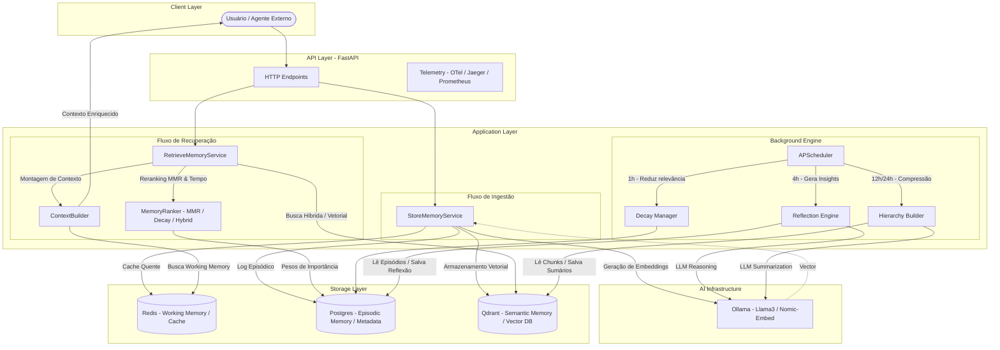

# Agent Memory Engine 🧠


> Uma engine de memória avançada para agentes de IA que precisam lembrar do passado, aprender com o presente e planejar o futuro.

Este projeto não é apenas um banco de dados; é um **sistema nervoso central** para agentes de Inteligência Artificial. Ele decide o que é importante lembrar, o que deve ser esquecido e como recuperar a informação certa no momento certo.

## 📚 Sumário

- [🧭 Visão Geral](#-visão-geral)
- [🏗️ Arquitetura e Tecnologias](#-arquitetura-e-tecnologias)
- [🚀 Funcionalidades](#-funcionalidades)
- [📁 Estrutura do Repositório](#-estrutura-do-repositório)
- [🛠️ Instalação e Setup](#-instalação-e-setup)
- [🧪 Como Usar (Endpoints)](#-como-usar-endpoints)
- [📊 Observabilidade](#-observabilidade)
- [✅ Testes e Coverage](#-testes-e-coverage)
- [📖 Documentação Teórica](#-documentação-teórica)

---

## 🧭 Visão Geral

O **Agent Memory Engine** resolve os problemas clássicos de memória em LLMs:
- **Context Window Management**: Decide o que manter na memória RAM (Redis) e o que arquivar.
- **Semantic Retrieval**: Busca por significado, não apenas palavras-chave.
- **Episodic Continuity**: Mantém a ordem cronológica dos fatos.
- **Cognitive Reflection**: O sistema "reflete" sobre memórias passadas para gerar novos insights.

### 🧠 Camadas de Memória:
1.  **Working Memory (RAM)**: Redis. Contexto imediato e ultra-rápido.
2.  **Semantic Memory (Fatos)**: Qdrant. Busca vetorial por similaridade.
3.  **Episodic Memory (Diário)**: PostgreSQL. Sequência temporal de eventos.
4.  **Hierarchical Memory (Resumos)**: Organização multinível de informações.

---

## 🏗️ Arquitetura e Tecnologias

O sistema é dividido em três fluxos principais: Ingestão, Recuperação e Processamento em Background.



- **FastAPI**: Interface assíncrona de alta performance.
- **Qdrant**: Vector Database para busca semântica e híbrida (RRF).
- **Redis**: Cache de baixa latência para memória de curto prazo (Working Memory).
- **PostgreSQL**: Persistência de metadados, sequências episódicas e scores de importância.
- **Ollama**: LLM local para embeddings (nomic-embed-text) e geração de reflexões (Llama 3).
- **OpenTelemetry**: Rastreamento distribuído para análise de latência em cada camada.

---

## 🚀 Funcionalidades

- **Busca Híbrida (Hybrid Search)**: Combina Vetores com BM25 (palavras-chave).
- **MMR (Maximal Marginal Relevance)**: Garante diversidade nos resultados da busca.
- **Decaimento Temporal**: Memórias antigas perdem relevância gradualmente.
- **Reflexão Automática**: Scheduler que processa memórias em background para gerar insights.
- **Hierarquização de Contexto**: Cria resumos automáticos de sessões e usuários.

---

## 📁 Estrutura do Repositório

```text
alembic/                Configurações de migração de banco de dados
app/
├── application/        Casos de uso e orquestração (Business Logic)
├── domain/             Entidades e serviços de domínio
├── infrastructure/     Adaptadores de banco (Postgres, Qdrant, Redis)
├── interfaces/         Entradas do sistema (HTTP API)
├── schemas/            Modelos de validação Pydantic
├── telemetry/          Configurações de Tracing e Métricas
└── workers/            Tarefas de background (Scheduler)
benchmarks/             Scripts de teste de performance
docker/                 Dockerfiles da aplicação
monitoring/             Configurações de Grafana, Prometheus, Loki
tests/                  Suíte de testes unitários e integração
```

---

## 🛠️ Instalação e Setup

### 📋 Pré-requisitos
- Docker e Docker Compose
- Python 3.12+ (opcional para desenvolvimento local)

### 1. Preparar o Ambiente
```bash
cp .env.example .env
make docker-up
```

### 2. Configurar o Ollama
Após subir os containers, baixe os modelos necessários:
```bash
docker exec -it ollama ollama pull llama3
docker exec -it ollama ollama pull nomic-embed-text
```

---

## 🧪 Como Usar (Endpoints)

### 🩺 Health Check
```bash
curl http://localhost:8000/health
```

### 📊 Metrics (Prometheus)
```bash
curl http://localhost:8000/metrics
```

### 📥 Armazenar uma Memória
```bash
curl -X POST http://localhost:8000/memory/store \
  -H "Content-Type: application/json" \
  -d '{
    "content": "O usuário prefere programar em Python e utiliza o VS Code.",
    "memory_type": "semantic",
    "session_id": "dev_123",
    "importance_score": 0.8
  }'
```

### 🔍 Recuperar Memórias (Busca Semântica)
```bash
curl -X POST http://localhost:8000/memory/search \
  -H "Content-Type: application/json" \
  -d '{
    "query": "Qual a linguagem de programação favorita?",
    "session_id": "dev_123",
    "limit": 5
  }'
```

### 🧠 Working Memory (Redis)
```bash
# Get working memory for a session
curl http://localhost:8000/memory/working/<session_id>
```

### 👤 User Profile
```bash
curl http://localhost:8000/profile/<session_id>
```

### 🧠 Workers / Scheduler (manual triggers)

É possível disparar tarefas do scheduler manualmente para testes e E2E.

- Gerar reflexões (reflection):
```bash
curl -X POST http://localhost:8000/workers/reflect
```

- Aplicar decaimento de importância (decay):
```bash
curl -X POST http://localhost:8000/workers/decay
```

- Forçar promoção de hierarquia nível 2 (session summaries):
```bash
curl -X POST http://localhost:8000/workers/hierarchy/level2
```

- Forçar promoção de hierarquia nível 3 (agent summaries):
```bash
curl -X POST http://localhost:8000/workers/hierarchy/level3
```

Os endpoints aceitam query param `run_async=true|false` (default true). Se `run_async=false`, a chamada aguardará a execução e retornará status "completed".

---

## 📊 Observabilidade

O projeto vem com uma stack completa de observabilidade pré-configurada:

- **Prometheus**: Métricas de performance e runtime (`http://localhost:9090`).
- **Grafana**: Dashboards para visualização de dados (`http://localhost:3000`).
- **Jaeger**: Tracing distribuído para debugar latência (`http://localhost:16686`).
- **Loki & Promtail**: Centralização e análise de logs.

---

## ✅ Testes e Coverage

Para garantir a qualidade, mantemos uma cobertura de testes acima de 80%.

Observação: os testes importam o package 'app' diretamente. Antes de rodar os testes localmente, adicione o diretório do projeto ao PYTHONPATH ou instale em modo editable.

Windows (PowerShell):
```powershell
$env:PYTHONPATH = "$PWD"; pytest -q
```
Unix / macOS:
```bash
PYTHONPATH=. pytest -q
```

Ou instale o projeto em modo editable:
```bash
pip install -e .
pytest -q
```

Se estiver usando Docker / Docker Compose, use 'make test' que já prepara o ambiente.

---

## 📖 Documentação Teórica

Para uma imersão profunda nos algoritmos e decisões arquiteturais (RRF, MMR, Decay, etc.), consulte o guia técnico:
👉 **[ANALISE_MEMORIA.md](./ANALISE_MEMORIA.md)**
